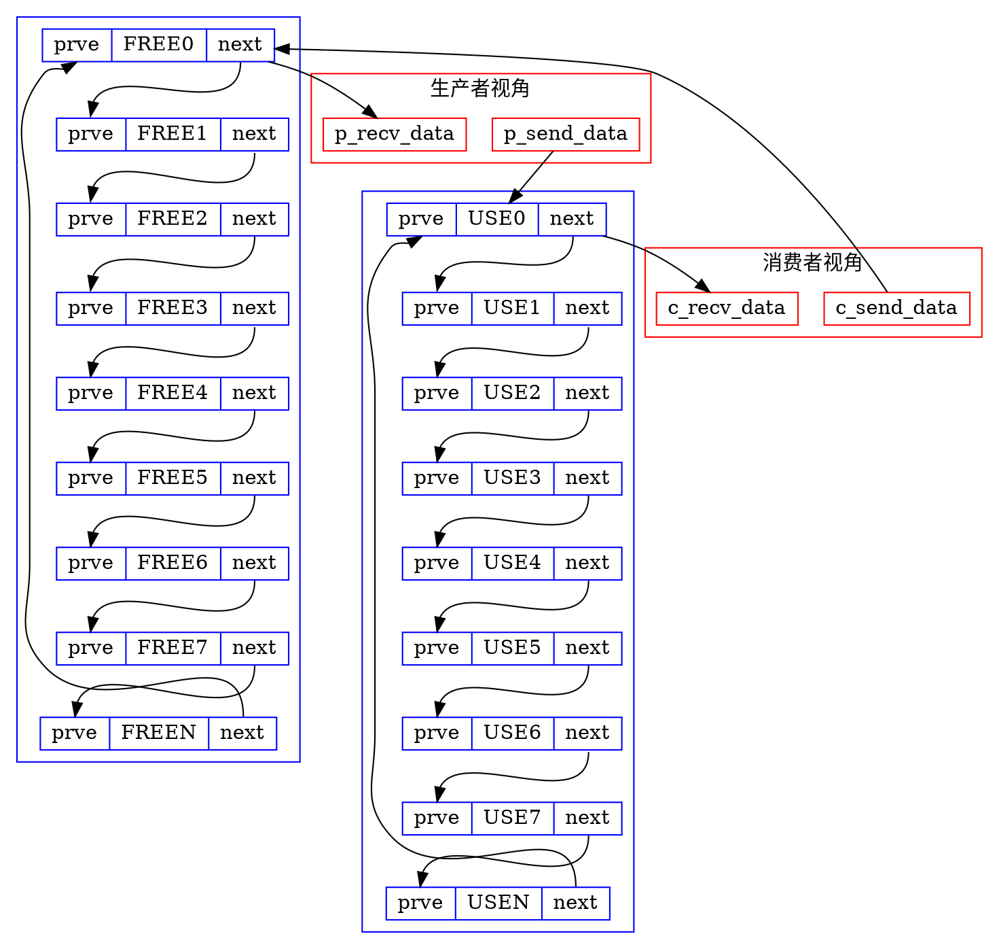

# smcf2
simple module communication framwork version 2.0

---
## 主要功能
### 功能简介
1. 异步消息 [async msg]
用于发送非实时,通知性的消息.

2. 同步消息 [sync msg]
用于发送实时性消息,发送方需要在接收方接收并处理完消息之后获取接收方的状态.

3. 数据收发 [recv/send data]
用于模块之间收发数据,数据可分为2种:
    - pointer (zero copy)
    - buffer  (copy)

4. 系统监控
用于监控smcf2系统种各个模块的运行状态,包括处理的msg次数,data次数,还未处理的msg & data个数,找出运行比较慢的模块等.

### 接口定义
#### 异步消息
##### 发送消息
```cpp
#define MSG_PRI_HIGH            0
#define MSG_PRI_MIDDLE          1
#define MSG_PRI_LOW             2

/**
 * func: send_msg
 * input:
 *   sender_id: the id of modules send msg
 *   receiver_id: the id of modules receiver msg
 *   msgpri: priority of this msg
 *   msgid: msg correspondence detial method in recriver module
 *   data: msg carries 16byte data to receiver module
 *
 * note:
 *   data: send module can carries 16byte data to receiver module,
 *         if we needn't carry data to receiver module, please set
 *         data == NULL.
 **/
int send_msg(int sender_id, int receiver_id, int msgpri, int msgid, char data[16]);
```
- sender_id
  发送信息的模块ID,该参数将会填充到msg中一起发送到receiver模块的邮箱中.
- receiver_id
  接收信息的模块ID,该参数用来在module manager模块中查找该模块对应的module_t信息,进而获取到该模块的邮箱,从其中获取到其它模块发过来的msg.
- msgpri
  邮箱的优先级,每个模块都会默认维护3个邮箱,这3个邮箱的优先级分别为高中低,模块在收取消息时会根据优先级从高到低检查邮箱,优先级高的消息会被优先取出,优先处理.
- msgid
  接收模块中对应的消息处理方法,msg ID定义在接收模块中,每一个msg ID对应一种消息处理方法.
- data
  发送模块发送消息时可以携带最多16byte的数据于data中一并发送给receiver模块.

>异步消息发送后会将消息发送到接收模块的消息邮箱中,接收模块会主动到邮箱中根据优先级取出数据.异步消息支持3种优先级: 高,中,低. 优先级高的消息会被优先处理.

##### 发送消息
```cpp
/**
 * func: recv_msg
 * input:
 *   sender_id: the id of modules that this msg send from
 *   receiver_id: the id of modules receiver msg
 *   msgid: msg correspondence detial method in recriver module
 *   data: msg carries 16byte data to receiver module
 *
 * note:
 *   data: send module can carries 16byte data to receiver module,
 *         if we needn't carry data to receiver module, please set
 *         data == NULL.
 *
 *   if auto_msg_process == 1, recv_msg invalied, modules receive
 *   msg by smcf auto manager, you can not recv_msg manually, otherwise
 *   this api will return -1.
 **/
int recv_msg(int *sender_id, int receiver_id, int *msgid, char data[16]);
```
- sender_id
  接收消息时sender_id将会保存当前接收到的msg消息发送方的module ID.
- receiver_id
  接收信息的模块ID,该参数用来在module manager模块中查找该模块对应的module_t信息,进而获取到该模块的邮箱,从其中获取到其它模块发过来的msg.
- msgid
  当前接收到的msg中的msg ID,在receiver模块中对应一种消息处理方法.
- data
  发送模块在发送msg时携带的最大16byte的data信息

> recv_msg用于用户主动收取msg消息,该接口的使用受模块中的auto_msg_process参数决定.
  若auto_msg_process=1, 则表示该模块的消息由smcf自动管理,用户无法手动获取消息.
  若auto_msg_process=0, 则表示该模块的消息需要用户调用该接口手动获取.

__异步消息邮箱__
```ditaa {cmd=true args=["-E"]}
        +-----------------+
    +---|     send_msg    |
    |   +-----------------+
    |H
    |  /-------------+-----------------------------------------\
    +->|cRED 0|cRED 1|cRED 2|cRED 3|cRED ....|cRED 126|cRED 127|---+
    |  \-------------+-----------------------------------------/   |
    |M                                                             |H
    |  /-------------+-----------------------------------------\   |
    +->|cBLU 0|cBLU 1|cBLU 2|cBLU 3|cBLU ....|cBLU 126|cBLU 127|---+
    |  \-------------+-----------------------------------------/   |
    |L                                                             |M
    |  /-------------+-----------------------------------------\   |
    +->|cPNK 0|cPNK 1|cPNK 2|cPNK 3|cPNK ....|cPNK 126|cPNK 127|---+
       \-------------+-----------------------------------------/   |
           ^                                                       |L
           |  +----------------+        +-----------------+        |
           +--|    msg mail    |        |     recv_msg    |<-------+
              +----------------+        +-----------------+

    +-----------------------------------------------------------+
    |send_msg根据recvier_id和msgpri将msg送入对应的邮箱中,recv_msg从邮箱中获取msg数据|
    +-----------------------------------------------------------+
```

#### 同步消息
```cpp
/**
 * func: send_msg_sync
 * input:
 *   sender_id: the id of modules send msg
 *   receiver_id: the id of modules receiver msg
 *   msgid: msg correspondence detial method in recriver module
 *   data: msg carries 16byte data to receiver module
 *
 * note:
 *   this API used to send sync msg, so you should ensure receive
 *   module support sync msg. if receive module do not support sync
 *   msg, this API will return error.
 **/
int send_msg_sync(int sender_id, int receiver_id, int msgid, char data[16]);
```
- sender_id
  发送信息的模块ID,该参数将会填充到msg中一起发送到receiver模块的邮箱中.
- receiver_id
  接收信息的模块ID,该参数用来在module manager模块中查找该模块对应的module_t信息,进而获取到该模块的邮箱,从其中获取到其它模块发过来的msg.
- msgid
  接收模块中对应的消息处理方法,msg ID定义在接收模块中,每一个msg ID对应一种消息处理方法.
- data
  发送模块发送消息时可以携带最多16byte的数据于data中一并发送给receiver模块.

> 同步消息接口用于模块间互相发送同步消息数据,同步消息实现的基础为接收同步消息的模块必须实现一个用于接收同步消息的回调函数接口,发送同步消息方会在该接口中根据接收方的模块ID搜索到接收方接收同步消息的回调函数

__同步消息回调__
```ditaa {cmd=true args=["-E"]}
/---------------\             /------------------\
| sender module |             | receiver module  |
+---------------+             +------------------+     +--------------+
| send_msg_sync |------------>| sync_msg_process |<----|cRED callback |
\---------------/             \------------------/     +--------------+
        |                              ^
        |                              |
        |       /----------------\     |
        +------>| module_manager |-----+
                \----------------/
```

#### 数据收发
```cpp
/**
 * data channel type
 **/
#define DATA_CHANNEL_SENDER    0
#define DATA_CHANNEL_RECEIVER  1
```
数据通道类型
- DATA_CHANNEL_SENDER: 数据发送方类型
- DATA_CHANNEL_RECEIVER: 数据接收方类型

```cpp
/**
 * data_channel_t
 * this struct used to config data channel attr
 **/
typedef struct __data_channel {
	int enable;		/* this channel enable or not, if not 1 indecate disable */
	int role; 		/* sender or receiver */
	int size; 		/* data channel node size */
	int num; 		/* node number of data channel */
	int module_id;		/* if module is sender set -1, if is receiver set sender id */
	int channel;		/* if module is sender set -1, if is receiver set sender channel id */
} data_channel_t;

/* reserved for special use */
typedef struct __data_channel_hook {
	int enable;		/* this channel enable or not, if not 1 indecate disable */
	int role; 		/* sender or receiver */
	int num; 		/* node number of data channel */
	int module_id;		/* if module is sender set -1, if is receiver set sender id */
	int channel;		/* if module is sender set -1, if is receiver set sender channel id */
} data_channel_hook_t;
```
数据通道结构体
- data_channel_t
  通用数据通道结构体,通过该结构体创建的数据通道在发送数据时需要将数据拷贝到数据通道的node中进行数据传输.
- data_channel_hook_t
  无数据拷贝(zero-copy)数据通道结构体,通过该结构体创建的数据通道不开辟数据内存,在发送数据时直接传输数据地址即可.

> data_channel_t结构体为通用数据通道结构体,可以满足所有的数据传输需求,但是在准备数据阶段需要有一次将数据拷贝到数据通道的操作.
data_channel_hook_t结构体专门为无需进行数据拷贝的数据通道，这个通道中传输的为数据指针，这个结构可以用data_channel_t结构代替，代价为多出了数据拷贝的系统开销。该结构主要用于内部使用，当客户使用数据通道时，不建议使用data_channel_hook_t结构体。

---
__数据通道结构

---

#### 模块逻辑
```cpp
typedef struct __module {
	int id;					/* module id */
	char *name;				/* module name */
	/* message process handler, the newer message can't be processed before
	 * current process finished, so don't blocked in this function */
	int auto_msg_process_en;
	int (*msg_process)(int sender_id, int msgid, char data[16]);
 	/* if sync_msg_process_en == 0, call this func report error */
	int sync_msg_process_en;
	int (*sync_msg_process)(int sender_id, int msgid, char data[16]);

	/* module data channel */
	data_channel_t channel[4];
	/* reserved module data hook channel */
	data_channel_hook_t hchannel[4];
} module_t;

int smcf_init(void);
int smcf_start(void);
void smcf_stop(void);
int smcf_module_register(module_t *module);
```
module由 __module manager__ 管理，module manager实际上是一张表，该表维护所有注册到smcf中的模块状态。
